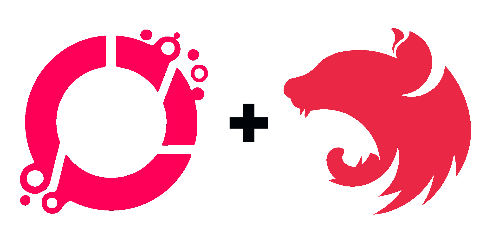

A NestJS module for seamless Azure Storage Queue integration with automatic message processing through decorators.

**NOTE:** This module is currently under development. Please do not use in production.

---

## Features

✨ **Decorator-based Queue Handlers** - Use simple decorators to mark methods as queue message processors  
🔄 **Automatic Message Polling** - Built-in polling mechanism with configurable intervals  
⚙️ **Flexible Configuration** - Support for both synchronous and asynchronous configuration  
🛡️ **Error Handling** - Automatic retry logic with configurable dequeue limits  
📝 **Comprehensive Logging** - Built-in logging for monitoring and debugging  
🚀 **Auto-discovery** - Automatically discovers and registers queue handlers at startup  
🧩 **Type Safety** - Full TypeScript support with generic types for message handling

---

## Installation

```bash
npm install @omnihash/nestjs-azure-storage-queue @azure/storage-queue
# or
yarn add @omnihash/nestjs-azure-storage-queue @azure/storage-queue
```

---

## Quick Start

### 1. Configure Environment

Create a `.env` file in your project root:

```env
AZURE_STORAGE_CONNECTION_STRING=DefaultEndpointsProtocol=https;AccountName=youraccount;AccountKey=yourkey;EndpointSuffix=core.windows.net
```

### 2. Setup Module

```typescript
// app.module.ts
import { Module } from '@nestjs/common';
import { ConfigModule, ConfigService } from '@nestjs/config';
import { AzureStorageQueueModule } from '@omnihash/nestjs-azure-storage-queue';
import { MessageProcessorService } from './message-processor.service';

@Module({
  imports: [
    ConfigModule.forRoot(),
    AzureStorageQueueModule.forRootAsync({
      useFactory: (configService: ConfigService) => {
        const connectionString = configService.get<string>(
          'AZURE_STORAGE_CONNECTION_STRING',
        );
        if (!connectionString) {
          throw new Error('AZURE_STORAGE_CONNECTION_STRING must be defined');
        }
        return {
          connectionString,
          defaultPollingInterval: 5000,
          defaultVisibilityTimeout: 30,
          defaultMaxDequeueCount: 5,
        };
      },
      inject: [ConfigService],
    }),
  ],
  providers: [MessageProcessorService],
})
export class AppModule {}
```

### 3. Create Message Processors

```typescript
// message-processor.service.ts
import { Injectable, Logger } from '@nestjs/common';
import { AzureStorageQueueHandler } from '@omnihash/nestjs-azure-storage-queue';

// Define your custom message types for type safety
interface UserNotification {
  userId: string;
  message: string;
  timestamp: string;
}

interface OrderData {
  orderId: string;
  customerName: string;
  items: Array<{ id: string; quantity: number }>;
  total: number;
}

@Injectable()
export class MessageProcessorService {
  private readonly logger = new Logger(MessageProcessorService.name);

  @AzureStorageQueueHandler<UserNotification>({
    queueName: 'user-notifications',
    pollingInterval: 3000,
    visibilityTimeout: 30,
    maxDequeueCount: 1,
    maxMessages: 10,
    messageBodyType: {} as UserNotification, // Type hint for message body
  })
  async handleUserNotifications(message: {
    id: string;
    body: UserNotification;
    dequeueCount: number;
    insertedOn: Date;
    expiresOn: Date;
  }) {
    this.logger.log(`Processing user notification: ${message.id}`);

    // Strongly typed message body - no need for parsing
    const notification = message.body;
    this.logger.log(
      `Notification for user ${notification.userId}: ${notification.message}`,
    );

    // Simulate processing
    await new Promise((resolve) => setTimeout(resolve, 1000));

    this.logger.log(`Completed processing message: ${message.id}`);
  }

  @AzureStorageQueueHandler<OrderData>({
    queueName: 'order-processing',
    pollingInterval: 1000,
    visibilityTimeout: 60,
    maxMessages: 20,
    maxDequeueCount: 10,
  })
  async handleOrderProcessing(message: AzureStorageQueueMessage<OrderData>) {
    this.logger.log(`Processing order: ${message.id}`);

    try {
      // Strongly typed message body - no need for parsing
      const orderData = message.body;

      // Full type safety with IDE intellisense
      this.logger.log(
        `Processing order ${orderData.orderId} for ${orderData.customerName}`,
      );
      this.logger.log(`Order contains ${orderData.items.length} items`);
      this.logger.log(`Total amount: $${orderData.total}`);

      // Process order logic here

      this.logger.log(`Order processed successfully: ${orderData.orderId}`);
    } catch (error) {
      this.logger.error(`Failed to process order: ${error.message}`);
      throw error; // This will cause the message to be retried
    }
  }
}
```

---

## Configuration

### Module Configuration Options

| Option                     | Type     | Description                                       | Default    |
| -------------------------- | -------- | ------------------------------------------------- | ---------- |
| `connectionString`         | `string` | Azure Storage connection string                   | _required_ |
| `defaultPollingInterval`   | `number` | Default polling interval in milliseconds          | `5000`     |
| `defaultVisibilityTimeout` | `number` | Default message visibility timeout in seconds     | `30`       |
| `defaultMaxDequeueCount`   | `number` | Default maximum dequeue count before poison queue | `5`        |

### Queue Handler Options

| Option              | Type     | Description                           | Default        |
| ------------------- | -------- | ------------------------------------- | -------------- |
| `queueName`         | `string` | Name of the Azure Storage Queue       | _required_     |
| `messageBodyType`   | `T`      | Type hint for message body            | _optional_     |
| `pollingInterval`   | `number` | Polling interval in milliseconds      | Module default |
| `visibilityTimeout` | `number` | Message visibility timeout in seconds | Module default |
| `maxMessages`       | `number` | Maximum messages to retrieve per poll | `1`            |
| `maxDequeueCount`   | `number` | Maximum dequeue count before deletion | Module default |

---

## Advanced Usage

### Static Configuration

```typescript
// app.module.ts
import { AzureStorageQueueModule } from '@omnihash/nestjs-azure-storage-queue';

@Module({
  imports: [
    AzureStorageQueueModule.forRoot({
      connectionString: 'your-connection-string',
      defaultPollingInterval: 3000,
      defaultVisibilityTimeout: 45,
      defaultMaxDequeueCount: 3,
    }),
  ],
})
export class AppModule {}
```

### Sending Messages

```typescript
import { Injectable } from '@nestjs/common';
import { AzureStorageQueueService } from '@omnihash/nestjs-azure-storage-queue';

// Define your message types
interface UserNotification {
  userId: string;
  message: string;
  timestamp: string;
}

interface OrderUpdate {
  orderId: string;
  status: string;
  updatedAt: string;
}

@Injectable()
export class NotificationService {
  constructor(private readonly queueService: AzureStorageQueueService) {}

  async sendNotification(userId: string, message: string) {
    // Create a strongly-typed message
    const notification: UserNotification = {
      userId,
      message,
      timestamp: new Date().toISOString(),
    };

    // Send typed message - automatic serialization
    await this.queueService.sendMessage<UserNotification>(
      'user-notifications',
      notification,
    );
  }

  async sendOrderUpdate(orderId: string, status: string) {
    // Create a strongly-typed message
    const update: OrderUpdate = {
      orderId,
      status,
      updatedAt: new Date().toISOString(),
    };

    // Send typed message - automatic serialization
    await this.queueService.sendMessage<OrderUpdate>(
      'order-processing',
      update,
    );
  }

  // You can still send simple string messages
  async sendSimpleMessage(queueName: string, text: string) {
    await this.queueService.sendMessage(queueName, text);
  }
}
```

### Multiple Queue Handlers with Type Safety

```typescript
@Injectable()
export class MultiQueueProcessor {
  private readonly logger = new Logger(MultiQueueProcessor.name);

  // High priority tasks with custom types
  interface HighPriorityTask {
    taskId: string;
    priority: number;
    data: Record<string, unknown>;
  }

  @AzureStorageQueueHandler<HighPriorityTask>({
    queueName: 'high-priority',
    pollingInterval: 1000,
    maxMessages: 5
  })
  async handleHighPriority(message: AzureStorageQueueMessage<HighPriorityTask>) {
    const task = message.body;
    this.logger.log(`High priority task ${task.taskId} with priority ${task.priority}`);
    // Handle high priority messages with full type safety
  }

  // Simple string messages for low priority queue
  @AzureStorageQueueHandler({
    queueName: 'low-priority',
    pollingInterval: 10000,
    maxMessages: 10,
  })
  async handleLowPriority(message: AzureStorageQueueMessage) {
    this.logger.log(`Low priority message: ${message.body}`);
    // Handle simple string messages
  }

  // Batch processing with complex objects
  interface BatchItem {
    items: Array<{ id: string; action: string }>;
    batchId: string;
    processingOptions: {
      parallel: boolean;
      timeout: number;
    };
  }

  @AzureStorageQueueHandler<BatchItem>({
    queueName: 'batch-processing',
    pollingInterval: 5000,
    maxMessages: 32, // Azure Storage Queue max
    visibilityTimeout: 120
  })
  async handleBatchProcessing(message: AzureStorageQueueMessage<BatchItem>) {
    const batch = message.body;
    this.logger.log(`Processing batch ${batch.batchId} with ${batch.items.length} items`);

    // Type-safe access to all properties
    if (batch.processingOptions.parallel) {
      this.logger.log(`Processing items in parallel with ${batch.processingOptions.timeout}ms timeout`);
    }

    // Process batch items
    for (const item of batch.items) {
      this.logger.log(`- Item ${item.id}: ${item.action}`);
    }
  }
}
```

---

## Message Format

Messages received by your handlers will have the following structure:

```typescript
interface AzureStorageQueueMessage<T = string> {
  id: string; // Message ID
  body: T; // Typed message content
  dequeueCount: number; // Number of times dequeued
  insertedOn: Date; // When message was inserted
  expiresOn: Date; // When message expires
}
```

Where `T` is the type of your message body. For simple string messages, it defaults to `string`. For complex objects, you can define your own interface.

---

## Error Handling

### Automatic Retry Logic

When a handler throws an error, the message becomes visible again after the `visibilityTimeout` and will be retried. If a message exceeds `maxDequeueCount`, it will be automatically deleted (poison message handling).

### Custom Error Handling

```typescript
@AzureStorageQueueHandler({
  queueName: 'error-prone-queue',
  maxDequeueCount: 3,
})
async handleWithErrors(message: any) {
  try {
    // Process message
    await this.processMessage(message.body);
  } catch (error) {
    this.logger.error(`Processing failed: ${error.message}`, {
      messageId: message.id,
      dequeueCount: message.dequeueCount,
    });

    if (message.dequeueCount >= 2) {
      // Send to dead letter queue or alert
      await this.handlePoisonMessage(message);
    }

    throw error; // Re-throw to trigger retry
  }
}
```

### Message Schema Validation

You can combine type hints with schema validation libraries for runtime safety:

```typescript
import { z } from 'zod';
import { validateOrReject } from 'class-validator';
import { plainToInstance } from 'class-transformer';

// Option 1: Using Zod
const UserSchema = z.object({
  userId: z.string(),
  email: z.string().email(),
  preferences: z.object({
    notifications: z.boolean(),
    theme: z.enum(['light', 'dark']),
  }),
});

type User = z.infer<typeof UserSchema>;

@AzureStorageQueueHandler<User>({
  queueName: 'user-updates'
})
async handleUserUpdates(message: AzureStorageQueueMessage<User>) {
  try {
    // Validate at runtime
    UserSchema.parse(message.body);

    // Process validated message
    await this.processUserUpdate(message.body);
  } catch (error) {
    this.logger.error(`Invalid message schema: ${error.message}`);
    // Handle invalid schema (do not retry)
  }
}

// Option 2: Using class-validator
class OrderDto {
  @IsString()
  orderId: string;

  @IsNumber()
  amount: number;

  @IsArray()
  @ValidateNested({ each: true })
  items: OrderItemDto[];
}

@AzureStorageQueueHandler<OrderDto>({
  queueName: 'orders',
  messageBodyType: {} as OrderDto,
})
async handleOrder(message: AzureStorageQueueMessage<OrderDto>}) {
  try {
    // Transform plain object to class instance
    const orderDto = plainToInstance(OrderDto, message.body);

    // Validate the instance
    await validateOrReject(orderDto);

    // Process validated message
    await this.processOrder(orderDto);
  } catch (errors) {
    this.logger.error(`Validation failed:`, errors);
    // Handle invalid data
  }
}
```

---

## Best Practices

1. **Queue Naming**: Use descriptive, kebab-case names for queues
2. **Message Size**: Keep messages under 64KB (Azure Storage Queue limit)
3. **Idempotency**: Design handlers to be idempotent in case of retries
4. **Monitoring**: Use the built-in logging to monitor queue processing
5. **Error Handling**: Implement proper error handling and poison message detection
6. **Resource Cleanup**: The module automatically cleans up polling intervals on shutdown
7. **Type Definitions**: Define TypeScript interfaces for all your message types
8. **Schema Validation**: Combine type hints with runtime validation for maximum safety

---

## API Reference

### AzureStorageQueueModule

#### Static Methods

- **`forRoot(config: AzureStorageQueueConfig): DynamicModule`**  
  Configure the module with static configuration

- **`forRootAsync(options: AsyncModuleOptions): DynamicModule`**  
  Configure the module with dynamic configuration using factories

### AzureStorageQueueService

#### Methods

- **`sendMessage<T = string>(queueName: string, message: T): Promise<void>`**  
  Send a typed message to the specified queue

- **`createQueueIfNotExists(queueName: string): Promise<QueueClient>`**  
  Create a queue if it doesn't exist and return the client

- **`startPolling<T = string>(options: AzureStorageQueuePollingOptions, handler: (message: AzureStorageQueueMessage<T>) => Promise<void>): Promise<void>`**  
  Start polling a queue (used internally by the decorator)

- **`stopPolling(queueName: string): void`**  
  Stop polling a specific queue

### @AzureStorageQueueHandler

Decorator to mark methods as queue message handlers.

```typescript
@AzureStorageQueueHandler<T = string>(options: AzureStorageQueuePollingOptions<T>)
```

Where `T` is the type of message body you expect to receive.

---

## Troubleshooting

### Common Issues

**Connection String Invalid**

```
Error: AZURE_STORAGE_CONNECTION_STRING must be defined
```

Ensure your connection string is properly set in environment variables.

**Queue Not Found**
Queues are automatically created when first accessed. Ensure your Azure Storage account has the necessary permissions.

**Messages Not Processing**
Check that:

- Your handler methods are in services registered with NestJS
- The `@AzureStorageQueueHandler` decorator is properly applied
- Queue names match exactly (case-sensitive)

### Debug Logging

Enable debug logging to see module activity:

```typescript
// main.ts
import { Logger } from '@nestjs/common';

const app = await NestFactory.create(AppModule, {
  logger: ['error', 'warn', 'log', 'debug'],
});
```

---

## License

MIT

---

## Contributing

Contributions are welcome! Please feel free to submit a Pull Request.
